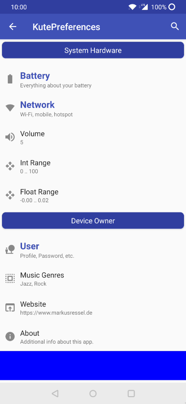

# KutePreferences | [](https://codebeat.co/projects/github-com-markusressel-kutepreferences-master) |

A **GUI** library for easy to use, fast and beautiful **preferences** in your app.



# Features

* [x] Easy to use
* [x] Many included preference types
* [x] Expandable with custom styles and logic
* [x] Integrated search
* [x] Persistence
* [x] Written entirely in Kotlin & Compose

# How to use

Have a look at the demo app (```app```  module) for a complete sample. The sample app uses **Dagger 2** (Hilt) for
Dependency Injection but this is not a requirement.

## Gradle

To use this library just include it in your dependencies using

```groovy
repositories {
    ...
    maven { url "https://jitpack.io" }
}
```

in your project build.gradle file and

```groovy
dependencies {
    ...

    def kutePreferencesVersion = "v3.0.0"
    // choose the ones you need
    implementation("com.github.markusressel.KutePreferences:core:${kutePreferencesVersion}")
    implementation("com.github.markusressel.KutePreferences:ui:${kutePreferencesVersion}")
}
```

in your desired module `build.gradle` file.

## Create a KutePreferences ViewModel

TODO: this needs a major rewrite for the compose implementation.

Since **KutePreferences** provides navigation between categories, search and other things, you have to create a
ViewModel for your preferences and extend the provided `KutePreferencesViewModel`. Make sure to call the
`initPreferenceTree()` to setup the items that should be shown:

```kotlin
class YourPreferencesViewModel(
    navigator: KuteNavigator,
) : KutePreferencesViewModel(navigator) {

    private val dataProvider by lazy {
        DefaultKutePreferenceDataProvider(context)
    }

    init {
        val preferenceTree = createPreferenceTree()
        initPreferencesTree(preferenceTree)
    }

    private fun createPreferenceTree(): List<KutePreferenceListItem> {
        return listOf(
            KuteTextPreference(
                key = R.string.key_demo_text_pref,
                title = R.string.title_demo_text_pref,
                defaultValue = "",
                dataProvider = dataProvider
            )
        )
    }
}
```

## Structure

The items that you return in the `initPreferenceTree()` method are a direct representation of the categories, sections
preferences and custom items that will be visible in your app. Items that need persistence require a `KuteDataProvider`
parameter that defines how the current state of the preference item is persisted.

### Preference Types

KutePreferences includes implementation for most of the commonly needed preference items that you might encounter when
building an app.

| Name                       | Item Type            | Description                                                                                                       |
|----------------------------|----------------------|-------------------------------------------------------------------------------------------------------------------|
| KuteBooleanPreference      | Boolean              | A simple on/off preference.                                                                                       |
| KuteTextPreference         | String               | A simple text preference.                                                                                         |
| KuteUrlPreference          | String               | A url preference.                                                                                                 |
| KutePasswordPreference     | String               | A password text preference. This type works exactly like `KuteTextPreference` but includes obscuring typed input. |
| KuteNumberPreference       | Integer              | A preference for number values.                                                                                   |
| KuteSliderPreference       | Integer              | Like `KuteNumberPreference` but with a slider GUI instead of a direct input field.                                |
| KuteDatePreference         | Date                 | Let's the user select and store a date.                                                                           |
| KuteTimePreference         | TimePersistenceModel | Let's the user select and store a time of the day.                                                                |
| KuteColorPreference        | Color                | Let's the user select and store an ARGB color.                                                                    |
| KuteSingleSelectPreference | List\<T\>            | Allows a single selection from a specified list of items.                                                         |
| KuteMultiSelectPreference  | List\<T\>            | Allows to select multiple items from a specified list of items.                                                   |

### Other Types

If you want to implement other list items that don't need any persistence you can use one of these implementations:

| Name       | Description                                   |
|------------|-----------------------------------------------|
| KuteAction | A simple `click` action provided with a name. |

### Grouping

For better context preference items can be grouped in categories or divided by simple headlines. To do this you can use
one of these classes:

| Name         | Description                                                               |
|--------------|---------------------------------------------------------------------------|
| KuteCategory | A category groups sections, preference items and/or other category items. |
| KuteSection  | A group of preference items inside a single preference category.          |

## Render the UI

At the location of choice use the `KutePreferencesTheme` together with the `KuteOverview` and pass the preferences tree
to it:

```kotlin
KutePreferencesTheme {
    val currentItems by vm.currentPreferenceItems.collectAsState(initial = emptyList())

    KuteOverview(
        modifier = Modifier.fillMaxSize(),
        items = currentItems
    )
}
```

### Theming

KutePreferences is based on Material Design 3 by default, and will automatically inherit the styling of your app (if you
use MD3 in you app). You can override the styling by passing colors to the `KutePreferencesTheme`:

```kotlin
val defaultColors = defaultColors()
KutePreferencesTheme(
    colors = defaultColors.copy(
        category = defaultColors.category.copy(
            titleColor = Color.Red
        )
    )
) {
    ...
}
```

## Implement custom preferences

To implement a custom type, first create a class that implements
the [KutePreferenceListItem](core/src/main/java/de/markusressel/kutepreferences/core/preference/KutePreferenceListItem.kt)
interface. Take a look at
the [CustomPreference](app/src/main/java/de/markusressel/kutepreferences/app/domain/CustomPreference.kt)
for a complete example. If it fits your needs
the [KutePreferenceItem](core/src/main/java/de/markusressel/kutepreferences/core/preference/KutePreferenceItem.kt) base
class can be used instead of implementing everything from scratch (which has some basic functionality implemented
already).

Important things to keep in mind if you implement your own preference item:

* remember to update the description of a preference item to always reflect the currently persisted value
* when defining layouts remember to use theme values from the `LocalKuteColors.current` object
* to replicate the look of a "default list item", use the `DefaultPreferenceListItem` composable

### Register Custom Types

KutePreferences already has built-in types for most of the commonly required preferences. If you need change/override an
existing type, or create a completely custom one, you can register your own like this:

```kotlin
class YourPreferencesViewModel(...) : KutePreferencesViewModel(navigator) {

    init {
        KuteStyleManager.registerTypeHook { listItem ->
            when (listItem) {
                is YourCustomPreference -> {
                    YourCustomPreferenceView(listItem)
                    true
                }
                else -> false
            }
        }

        ...
    }
}
```

# Troubleshooting

## Navigation

* The back button doesn't work
    * ensure that you are calling the `kuteNavigator.goBack()` method when a back press is registered
      by the activity that is hosting it (like seen in the example app)

# Contributing

GitHub is for social coding: if you want to write code, I encourage contributions through pull requests from forks of
this repository. Create GitHub tickets for bugs and new features and comment on the ones that you are interested in.

# License

```

MIT License

Copyright (c) 2018 Markus Ressel

Permission is hereby granted, free of charge, to any person obtaining a copy
of this software and associated documentation files (the "Software"), to deal
in the Software without restriction, including without limitation the rights
to use, copy, modify, merge, publish, distribute, sublicense, and/or sell
copies of the Software, and to permit persons to whom the Software is
furnished to do so, subject to the following conditions:

The above copyright notice and this permission notice shall be included in all
copies or substantial portions of the Software.

THE SOFTWARE IS PROVIDED "AS IS", WITHOUT WARRANTY OF ANY KIND, EXPRESS OR
IMPLIED, INCLUDING BUT NOT LIMITED TO THE WARRANTIES OF MERCHANTABILITY,
FITNESS FOR A PARTICULAR PURPOSE AND NONINFRINGEMENT. IN NO EVENT SHALL THE
AUTHORS OR COPYRIGHT HOLDERS BE LIABLE FOR ANY CLAIM, DAMAGES OR OTHER
LIABILITY, WHETHER IN AN ACTION OF CONTRACT, TORT OR OTHERWISE, ARISING FROM,
OUT OF OR IN CONNECTION WITH THE SOFTWARE OR THE USE OR OTHER DEALINGS IN THE
SOFTWARE.

```
